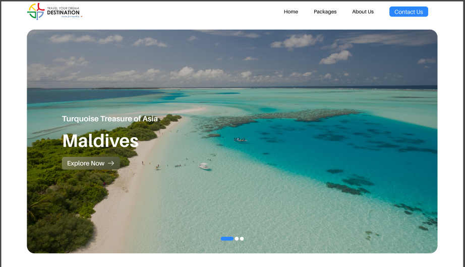

# TYDD (Travel Your Dream Destination)

## How to get started

- Clone the repo
  - `git clone https://github.com/akshay1502/tydd.git`
- Install all dependencies
  - `npm install`
- Running the project
  - `npm run dev`

## Tech Stack used

- Nextjs
- [Payload cms](https://payloadcms.com/docs/getting-started/what-is-payload)
- Postgres by supabase
- Supabase storage
- vercel

## /src/app includes below folders

- **/(frontend)** - contains all frontend routes
- **/(payload)** - automaticall genereated by payload
- **/(api)** - APIs for handling form submissions

> [!CAUTION]
> Don't make any changes in **/(payload)** folder.

> [!NOTE]
> To access cms hit _/admin_ route.

## Payload

- **/src/collections** - contains all the collections
- **/src/globals** - contains global pages
- **/src/payload** - contain payload instance to be used for local APIs

## Project working

- Know the **.env** variables required from [.env.example](https://github.com/akshay1502/tydd/blob/QA/.env.example) file
- Find the configuration for postgres and storage provider by supabase in [payload-config.ts](https://github.com/akshay1502/tydd/blob/QA/src/payload.config.ts) file
- Running `npm run dev` will create migrations and will pull the data from DB automatically (no need for manual migrations)
- [Local APIs](https://payloadcms.com/docs/local-api/overview) by payload are used for faster performance and low latency
- Find cms level restrictions in `/src/access`

## Miscellaneous

- Project uses `shadcn` and `tailwind` for rendering frontend UI elements
- `Nodemailer` is being used for sending mails
- Forms are handled using `react-hook-form` along with `zod` for validations
- `Swiper` is being used for serving multipel use cases
- `yet-another-react-lightbox` package for showcasing gallery
- `gsap` for animations
